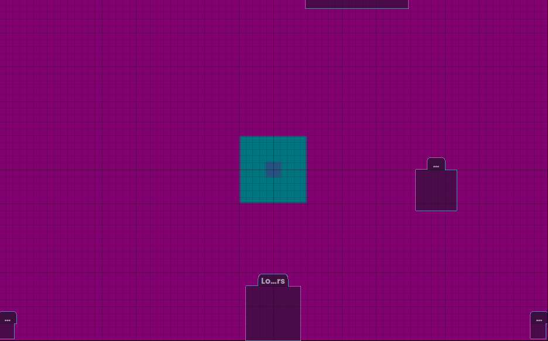

# Road map

1. Collect Sound.
2. Sound re-noising.
4. Create audio visualion matrix.

5. Collecting the average for each device (bulb / strip

7. Sending data to devices via Wi-Fi

# Hardware platform

[Arduino Nano RP2040 Connect](https://store.arduino.cc/products/arduino-nano-rp2040-connect#looxReviews)

| :                        Tech specs                      : ||
| :--------------------- | :--------------------------------- |
| Board                  | Nano RP2040 Connect                |
|                        | SKU: ABX00052                      |

| :    Easy Multiline   : |||
| :----- | :----- | :------ |
| Apple  | Banana | Orange  \
| Apple  | Banana | Orange  \
| Apple  | Banana | Orange
| Apple  | Banana | Orange  \
| Apple  | Banana | Orange  |
| Apple  | Banana | Orange  |

<table>
    <thead>
        <tr>
            <th>Layer 1</th>
            <th>Layer 2</th>
            <th>Layer 3</th>
        </tr>
    </thead>
    <tbody>
        <tr>
            <td rowspan=4>L1 Name</td>
            <td rowspan=2>L2 Name A</td>
            <td>L3 Name A</td>
        </tr>
        <tr>
            <td>L3 Name B</td>
        </tr>
        <tr>
            <td rowspan=2>L2 Name B</td>
            <td>L3 Name C</td>
        </tr>
        <tr>
            <td>L3 Name D</td>
        </tr>
    </tbody>
</table>

| Microcontroller        | Raspberry Pi® RP2040               |
| USB connector          | Micro USB                          |
| Pins                   | Built-in LED pin                   | 13                     |
| Analog Input Pins      | 20                                 |
| Analog Input Pins      | 8                                  |
| PWM pins               | 20 (Except A6, A7)                 |
| External interrupts    | 20 (Except A6, A7)                 |
| Connectivity           | Wi-Fi                              | Nina W102 uBlox module |
| Bluetooth®             | Nina W102 uBlox module             |
| Secure element         | ATECC608A-MAHDA-T Crypto IC        |
| Sensors                | IMU                                | LSM6DSOXTR (6-axis)    |
| Microphone             | MP34DT05                           |
| Communication          | UART                               | Yes                    |
| I2C                    | Yes                                |
| SPI                    | Yes                                |
| Power                  | Circuit operating voltage          | 3.3V                   |
| Input Voltage (VIN)    | 5-21V                              |
| DC Current per I/O pin | 4 mA                               |
| Clock speed            | Processor                          | 133 MHz                |
| Memory                 | AT25SF128A-MHB-T                   | 16MB Flash IC          |
| Nina W102 uBlox module | 448 KB ROM, 520KB SRAM, 16MB Flash |
| Dimensions             | Weight                             | 6 g                    |
| Width                  | 18 mm                              |
| Length                 | 45 mm                              |
